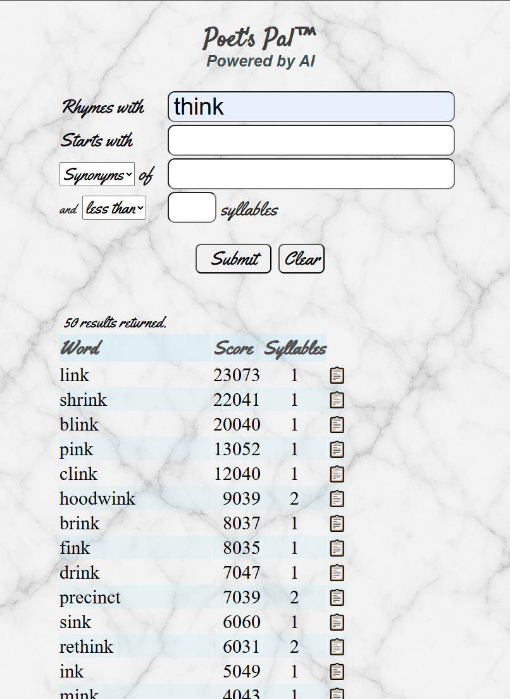

# Poet's Pal&trade;
## Rhyming Dictionary and Thesaurus — [Try it!](https://eugeneolsen.github.io/poetpal)
## Mobile first, responsive, powered by AI  

### Variations using different tools and frameworks:
- Vanilla HTML, JavaScript, CSS: [Try the app!](https://eugeneolsen.github.io/poetpal)  
- Next.js, TypeScript, Tailwind: Under development  
- Vue.js, TypeScript, SCSS: Planned  
- Svelte, TypeScript, Tailwind: Planned  
---
Search results are provided by the [Datamuse API](https://www.datamuse.com/api/)  
[Profane Words list](https://github.com/zacanger/profane-words#readme) for filter courtesy Zac Anger.
## Description
## Features
## Usage
### Input
### Output