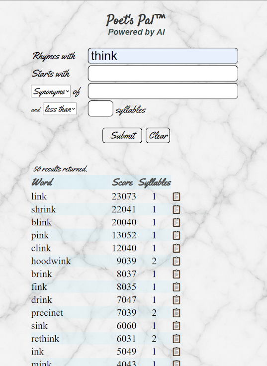

# Poet's Pal&trade;
## Rhyming Dictionary and Thesaurus — [Try it!](https://eugeneolsen.github.io/poetpal)
## Mobile first, responsive, powered by AI  

### Variations using different tools and frameworks:
- Vanilla HTML, JavaScript, CSS: [Try the app!](https://eugeneolsen.github.io/poetpal)  
- Next.js, TypeScript, Tailwind: Under development  
- Vue.js, TypeScript, SCSS: Planned  
- Svelte, TypeScript, Tailwind: Planned  
---
Search results are provided by the [Datamuse API](https://www.datamuse.com/api/)  
[Profane Words list](https://github.com/zacanger/profane-words#readme) for filter courtesy Zac Anger.
## Description
The Poet's Pal application is a combined rhyming dictionary and thesaurus, powered by artificial intelligence (AI). The rhyming dictionary and thesaurus can be combined or used independently.  Results can further be filtered by number of syllables and how the word begins.  The latter can aid in alliteration and initial assonance, if desired.
## Features
- Rhyming Dictionary
- Thesaurus
- Filters: Rhyming results can be filtered by:
  - Synonymns or Antonyms
  - Letters with which the resulting words start
  - Number of syllables
- One-click copying of results
- Score indicating how well each result word rhymes

## Usage
### Input
Type the word for which you want to find rhyming words in the top input field, the "Rhymes with" field.  At this point you can click the "Submit" button (or just press the Enter key) and up to 50 rhyming words will be displayed in the output table.  This is the simplest use case for the Poet's Pal.  

The remaining input fields are for filters, though the "Synonyms/Antonyms of" field can be used independently.  More than one filter can be used at the same time. For example:  

Rhymes with "think"  
Starts with "d"  
Synonym of "beverage"  

This combination of filters will yield one result: "drink"  

The filters accumulate with a logical "and," in other words, the above scenario behaves like:  
Rhymes with "think" *and* Starts with "d" *and* is a Synonym of "beverage".  

If you are writing a poem and want to maintain rhythm, you may want a limited or exact number of syllables.  You can use the "less than/exactly" ( ) "Syllables" field to limit the words in the output list to words of that many syllables.

### Output
The output is organized into a table with three columns: Word, Score, and Syllables.  

The Word column contains a word that rhymes with, or nearly rhymes with the word you entered in the "Rhymes with" field.  Near rhymes, if there are any, are indicated by *italicized* words.

The Score column indicates how well the word rhymes with the original word.  Higher numbers are considered to be better rhymes.   The table is sorted by the Score, with the higher scoring words being at the top.  

The Syllables column tells how many syllables are in the rhyming word.  

To the right of each row in the output table is a Copy icon. Clicking the Copy icon will copy the word in the Word column to the clipboard, and can then be pasted into another application.  
